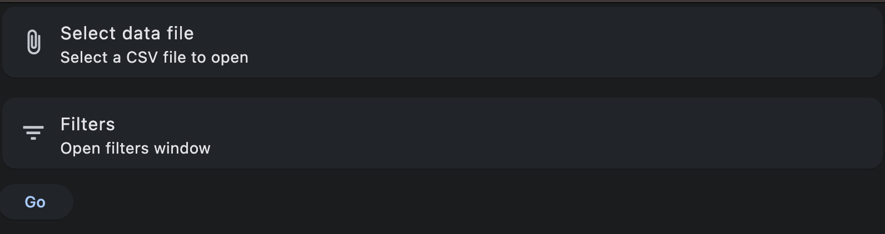
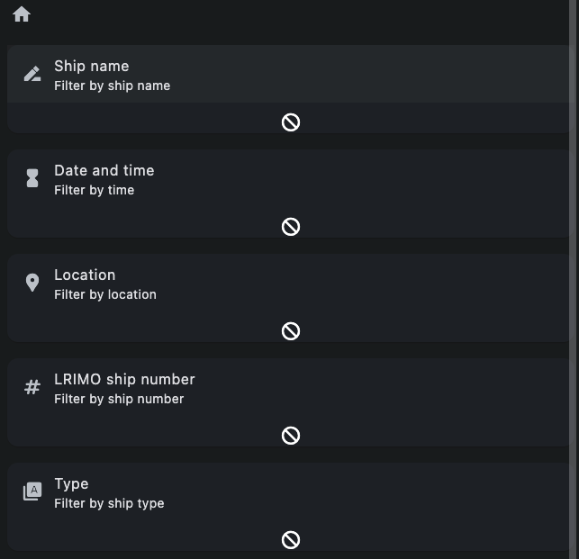
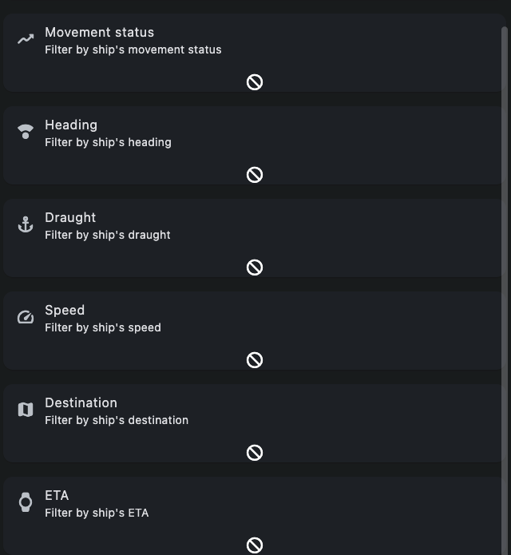
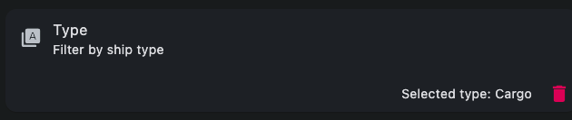
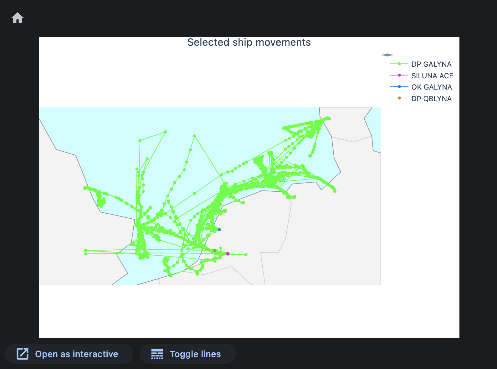

# ShipRadar

Application for plotting ships' paths using CSV file with data.

## Usage
#### As a native app
1. Download the latest release from [here](https://github.com/k-wlosek/ShipRadar/releases).
2. Unpack the archive.
3. Run the ShipRadar binary.

#### As a Python script
1. Clone the repository.
2. Install the dependencies:
    ```bash
    pip install -r requirements.txt
    ```
3. Run the script:
    ```bash
    python3 main.py
    ```
4. App will run as a web app on `http://localhost:5025/`.


### Screenshots
Main Window:

Filter types:


Selected filter:

Resulting plot:


### CSV file format
The CSV file should contain the following columns:

LRIMOShipNo, ShipName, ShipType, MovementDateTime, Longitude, Latitude, MoveStatus, Heading, Draught, Speed, Destination, ETA

#### Known issues
- Web app functionality is broken, use the native app instead.
